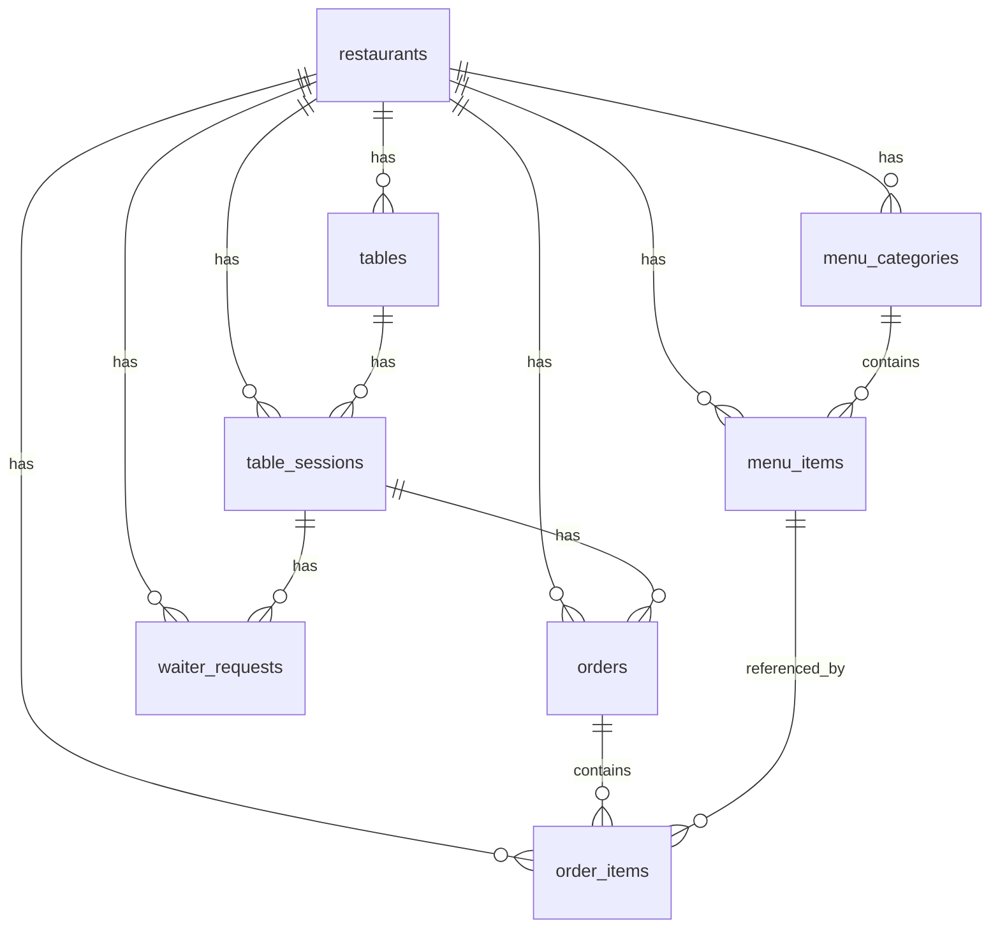

# TableFlow — Database Schema

## Overview

TableFlow uses Supabase (PostgreSQL) with Row Level Security (RLS) for tenant isolation. Every table except `restaurants` includes a `restaurant_id` foreign key to enforce multi-tenancy at the data level.

---

## Entity Relationship Diagram

---

## Tables

### 1. `restaurants` (Tenant Table)

The root entity. Every other table references this via `restaurant_id`.

| Column | Type | Constraints | Description |
|--------|------|-------------|-------------|
| `id` | UUID | PK, auto-generated | Unique restaurant identifier |
| `slug` | TEXT | UNIQUE, NOT NULL | URL-safe identifier for routing (`/[slug]/...`) |
| `name` | TEXT | NOT NULL | Display name |
| `logo_url` | TEXT | nullable | Brand logo URL |
| `brand_color` | TEXT | nullable | Hex color for white-label theming |
| `currency` | TEXT | NOT NULL, default `'INR'` | Currency code |
| `timezone` | TEXT | NOT NULL, default `'Asia/Kolkata'` | IANA timezone |
| `created_at` | TIMESTAMPTZ | NOT NULL, auto | Creation timestamp |

---

### 2. `tables` (Physical Tables)

Represents physical tables in the restaurant.

| Column | Type | Constraints | Description |
|--------|------|-------------|-------------|
| `id` | UUID | PK | Table identifier |
| `restaurant_id` | UUID | FK → restaurants, NOT NULL | Tenant scope |
| `label` | TEXT | NOT NULL | Human-readable name (e.g., "Table 4") |
| `qr_code_url` | TEXT | nullable | Generated QR code image URL |
| `created_at` | TIMESTAMPTZ | NOT NULL, auto | Creation timestamp |

**Indexes:** `restaurant_id`

---

### 3. `table_sessions` (Active Sessions)

One active session per table at a time. Waiter opens when seating customers.

| Column | Type | Constraints | Description |
|--------|------|-------------|-------------|
| `id` | UUID | PK | Session identifier |
| `restaurant_id` | UUID | FK → restaurants, NOT NULL | Tenant scope |
| `table_id` | UUID | FK → tables, NOT NULL | Which table |
| `otp` | CHAR(4) | NOT NULL | 4-digit join code for customers |
| `otp_attempts` | INT | NOT NULL, default 0 | Failed OTP entries (max 5) |
| `status` | TEXT | NOT NULL, CHECK `active\|closed` | Session state |
| `opened_at` | TIMESTAMPTZ | NOT NULL, auto | When session started |
| `closed_at` | TIMESTAMPTZ | nullable | When session ended |

**Indexes:** `restaurant_id`, `table_id`, `status` (partial: active only)  
**Unique constraint:** Only one active session per `table_id` (partial unique index)

---

### 4. `menu_categories`

Groups menu items into sections.

| Column | Type | Constraints | Description |
|--------|------|-------------|-------------|
| `id` | UUID | PK | Category identifier |
| `restaurant_id` | UUID | FK → restaurants, NOT NULL | Tenant scope |
| `name` | TEXT | NOT NULL | Category name (e.g., "Mains") |
| `display_order` | INT | NOT NULL, default 0 | Sort position |

**Indexes:** `restaurant_id`

---

### 5. `menu_items`

Individual dishes or drinks.

| Column | Type | Constraints | Description |
|--------|------|-------------|-------------|
| `id` | UUID | PK | Item identifier |
| `restaurant_id` | UUID | FK → restaurants, NOT NULL | Tenant scope |
| `category_id` | UUID | FK → menu_categories, NOT NULL | Parent category |
| `name` | TEXT | NOT NULL | Item name |
| `description` | TEXT | nullable | Item description |
| `price` | NUMERIC | NOT NULL, CHECK ≥ 0 | Price in restaurant currency |
| `image_url` | TEXT | nullable | Item photo URL |
| `is_available` | BOOLEAN | NOT NULL, default true | Can be ordered right now |
| `display_order` | INT | NOT NULL, default 0 | Sort position within category |

**Indexes:** `restaurant_id`, `category_id`

---

### 6. `orders`

Customer orders placed within a session.

| Column | Type | Constraints | Description |
|--------|------|-------------|-------------|
| `id` | UUID | PK | Order identifier |
| `restaurant_id` | UUID | FK → restaurants, NOT NULL | Tenant scope |
| `session_id` | UUID | FK → table_sessions, NOT NULL | Parent session |
| `status` | TEXT | NOT NULL, CHECK `pending\|preparing\|ready\|served` | Order lifecycle |
| `notes` | TEXT | nullable | Special instructions |
| `created_at` | TIMESTAMPTZ | NOT NULL, auto | When order was placed |

**Indexes:** `restaurant_id`, `session_id`, `status`

---

### 7. `order_items`

Line items within an order. Price and name are **snapshots** (not live references).

| Column | Type | Constraints | Description |
|--------|------|-------------|-------------|
| `id` | UUID | PK | Line item identifier |
| `order_id` | UUID | FK → orders, NOT NULL | Parent order |
| `restaurant_id` | UUID | FK → restaurants, NOT NULL | Tenant scope |
| `menu_item_id` | UUID | FK → menu_items, NOT NULL | Source menu item |
| `quantity` | INT | NOT NULL, CHECK > 0 | How many |
| `unit_price` | NUMERIC | NOT NULL, CHECK ≥ 0 | Price at time of order |
| `name` | TEXT | NOT NULL | Item name at time of order |

**Indexes:** `order_id`, `restaurant_id`  
**Note:** `unit_price` and `name` are snapshots — if the menu item price changes later, existing orders are unaffected.

---

### 8. `waiter_requests`

"Call Waiter" button presses from customers.

| Column | Type | Constraints | Description |
|--------|------|-------------|-------------|
| `id` | UUID | PK | Request identifier |
| `restaurant_id` | UUID | FK → restaurants, NOT NULL | Tenant scope |
| `session_id` | UUID | FK → table_sessions, NOT NULL | Parent session |
| `status` | TEXT | NOT NULL, CHECK `pending\|acknowledged` | Request state |
| `created_at` | TIMESTAMPTZ | NOT NULL, auto | When requested |

**Indexes:** `restaurant_id`, `session_id`

---

## Row Level Security (RLS)

RLS is enabled on **all tables**. Key policies:

| Table | Anon (customer) | Authenticated (waiter/admin) |
|-------|-----------------|------------------------------|
| `restaurants` | Read all | Read + Write |
| `tables` | Read all | Read + Write + Delete |
| `table_sessions` | Read active only | Full CRUD |
| `menu_categories` | Read all | Read + Write + Delete |
| `menu_items` | Read all | Read + Write + Delete |
| `orders` | Read/Insert (active session only) | Read + Update |
| `order_items` | Read/Insert (active session only) | Read |
| `waiter_requests` | Insert (active session only) | Read + Update |

> **Important:** RLS is the last line of defense. API routes must also validate `restaurant_id` matches the session before any operation.

---

## Multi-Tenancy Rules

1. **Every query** must be scoped by `restaurant_id`
2. **Never** expose one tenant's data to another
3. **Always** validate `restaurant_id` matches session in API routes
4. RLS enforces this at the DB level as a safety net
